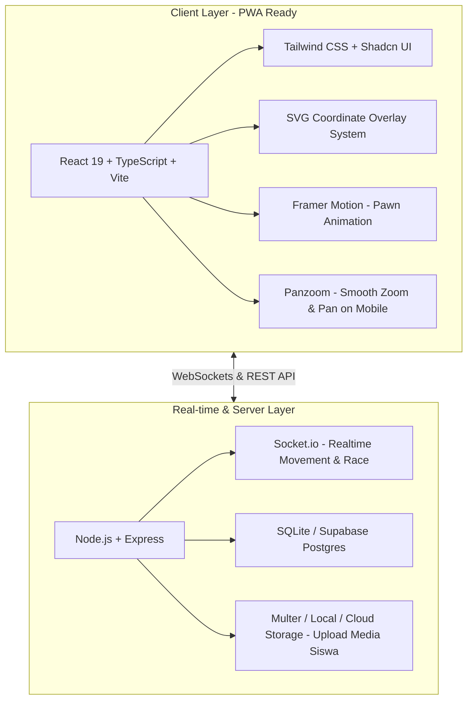
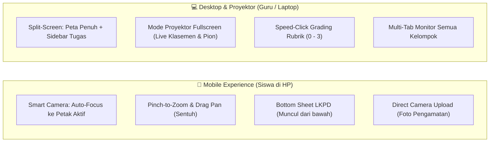

# 📋 IMPLEMENTATION PLAN: WEBSITE BOARD GAME EDUKASI EKOSISTEM (KELAS X SMA)
## Status: Final Architecture Design (Full Digital Integrated Web App)

Berdasarkan keputusan pengguna:
1. **Mode**: **Full Digital Web App** (Siswa bermain langsung di perangkat, pion bergerak digital, LKPD & lencana terintegrasi).
2. **Aset Visual**: Menggunakan gambar asli [image.png](file:///D:/Gameboard/image.png) (1600 × 1600 px) sebagai background kanvas papan permainan.
3. **Fitur Tambahan**: **Pre-test & Post-test** terintegrasi langsung dalam sistem untuk mengukur peningkatan keterampilan berpikir kritis siswa.

---

## 1. Rekomendasi Tech Stack Paling Sesuai

Untuk mengolah mentahan [image.png](file:///D:/Gameboard/image.png) (1600 × 1600 px) menjadi papan interaktif yang cepat, mulus, dan tahan terhadap kondisi internet sekolah, stack terbaik yang direkomendasikan adalah:

### Rincian Komponen Tech Stack:
| Komponen | Pilihan Teknologi | Alasan Kesesuaian untuk Project Ini |
| :--- | :--- | :--- |
| **Frontend Framework** | **React + Vite (TypeScript)** | Sangat ringan, booting super cepat, dan mudah di-bundle menjadi aplikasi responsif untuk HP/Laptop siswa. |
| **Papan Game Engine** | **Interactive SVG Overlay di atas `image.png` (1600x1600)** | Menggunakan sistem koordinat `viewBox="0 0 1600 1600"`. Pin petak, pion, efek hover, dan animasi lompat pion akan **100% presisi** di atas gambar asli tanpa pecah di layar apapun. |
| **Animasi & Interaksi** | **Framer Motion + Panzoom** | Memungkinkan siswa melakukan *pinch-to-zoom* dan *drag-to-pan* di HP saat melihat peta pulau, serta animasi pion melompat antar petak secara mulus (*smooth bezier curves*). |
| **Realtime Engine** | **Socket.io + Node.js** (atau **Supabase Realtime**) | Memastikan saat Kelompok 1 menyelesaikan tugas, pion mereka langsung bergerak di layar proyektor guru dan layar kelompok lain secara instan tanpa perlu reload. |
| **Basis Data** | **SQLite (Better-SQLite3)** atau **PostgreSQL** | Struktur data yang efisien untuk menyimpan jawaban LKPD, urutan lencana, dan skor pre/post-test. Sangat mudah di-*backup* atau dioperasikan secara offline di LAN sekolah jika internet mati. |

---

## 2. Struktur Modul & Alur Terintegrasi (3 Pertemuan)

Sistem membagi 24 aktivitas dan 50 petak ke dalam **3 Pertemuan Terstruktur**. Alur kerja dan interaksi antara Siswa (Gameboard) serta Guru (Fasilitator & Penilai) disajikan pada diagram alur berikut:

```mermaid
flowchart TD
    subgraph P1["📅 PERTEMUAN 1: Komponen Ekosistem (90 Menit)"]
        direction TB
        P1_A["1. Login Kelompok & Masuk Ruang Game"]
        P1_SPIN["2. 🎡 Sesi Spin: Penentuan Urutan Giliran Kelompok (Roda Putar)"]
        P1_B["3. Mengerjakan Pre-Test Berpikir Kritis (10 Soal C2-C5)"]
        P1_C["4. Menjelajah ZONA 1 (Komponen Ekosistem: Petak 1 s.d. 10)"]
        P1_D["5. 🏆 PEREBUTAN LENCANA 1 di Petak 10 (Juara 1, 2, 3)"]
        P1_E["6. 👨‍🏫 Guru: Penilaian Rubrik LKPD Zona 1 (Skor 0 - 3 per aktivitas)"]
        
        P1_A --> P1_SPIN --> P1_B --> P1_C --> P1_D --> P1_E
    end

    subgraph P2["📅 PERTEMUAN 2: Interaksi & Aliran Energi (90 Menit)"]
        direction TB
        P2_A["1. 📢 Pengumuman Hasil Skor LKPD Zona 1"]
        P2_B["2. Menjelajah ZONA 2 (Interaksi Makhluk Hidup: Petak 11 s.d. 22)"]
        P2_C["3. 🏆 PEREBUTAN LENCANA 2 di Petak 22 (Juara 1, 2, 3)"]
        P2_D["4. Menjelajah ZONA 3 (Aliran Energi: Petak 23 s.d. 38)"]
        P2_E["5. 🏆 PEREBUTAN LENCANA 3 di Petak 38 (Juara 1, 2, 3)"]
        P2_F["6. 👨‍🏫 Guru: Penilaian Rubrik LKPD Zona 2 & 3"]

        P2_A --> P2_B --> P2_C --> P2_D --> P2_E --> P2_F
    end

    subgraph P3["📅 PERTEMUAN 3: Jenis Ekosistem & Evaluasi Akhir (90 Menit)"]
        direction TB
        P3_A["1. 📢 Pengumuman Hasil Skor LKPD Zona 2 & 3"]
        P3_B["2. Menjelajah ZONA 4 (Jenis-Jenis Ekosistem: Petak 39 s.d. 50)"]
        P3_C["3. 🏆 PEREBUTAN LENCANA 4 di Petak 50 (Juara 1, 2, 3)"]
        P3_D["4. Mengerjakan Post-Test Berpikir Kritis (Evaluasi Akhir)"]
        P3_E["5. 👨‍🏫 Guru: Finalisasi Penilaian & Analisis N-Gain"]
        P3_F["6. 🥇 SELEBRASI GRAND LEADERBOARD (Total Skor LKPD + Lencana)"]

        P3_A --> P3_B --> P3_C --> P3_D --> P3_E --> P3_F
    end

    P1 -->|Lanjut ke Minggu/Sesi Berikutnya| P2
    P2 -->|Lanjut ke Minggu/Sesi Berikutnya| P3
```

### Matriks Rincian Alur Pembelajaran per Pertemuan:

| Sesi Pertemuan | Cakupan Zona & Petak | Aktivitas Siswa di Gameboard | Tindakan Guru di Dashboard | Output & Rekapitulasi Nilai |
| :--- | :--- | :--- | :--- | :--- |
| **Pertemuan 1** | **Zona 1 (Petak 1–10)** Sub-materi: *Komponen Ekosistem* | • Mengerjakan Pre-test (individu/tim) • Selesaikan 6 aktivitas KE-01 s.d. KE-06 • Race kecepatan menuju Petak 10 | • Buka Sesi Pertemuan 1 • Pantau live peta proyektor • Beri skor rubrik (0–3) untuk KE-01 s.d. KE-06 | • Skor Pre-test • Poin Lencana 1 (3, 2, 1 pt) • Skor LKPD KE (0–18 pt) |
| **Pertemuan 2** | **Zona 2 (Petak 11–22)** Sub-materi: *Interaksi Makhluk Hidup*  **Zona 3 (Petak 23–38)** Sub-materi: *Aliran Energi* | • Lihat skor Zona 1 yang telah dinilai • Selesaikan IA-01 s.d. IA-06 (Race Petak 22) • Selesaikan AE-01 s.d. AE-06 (Race Petak 38) • Upload video peragaan 1 menit | • Buka Sesi Pertemuan 2 • Tampilkan update leaderboard • Beri skor rubrik untuk aktivitas IA & AE | • Poin Lencana 2 (3, 2, 1 pt) • Poin Lencana 3 (3, 2, 1 pt) • Skor LKPD IA & AE (0–36 pt) |
| **Pertemuan 3** | **Zona 4 (Petak 39–50)** Sub-materi: *Jenis Ekosistem* | • Selesaikan JE-01 s.d. JE-06 (Race Petak 50) • Mengerjakan Post-test evaluasi • Melihat selebrasi juara kelas | • Buka Sesi Pertemuan 3 • Nilai aktivitas JE-01 s.d. JE-06 • Umumkan Juara Kelas (LKPD + Lencana) | • Poin Lencana 4 (3, 2, 1 pt) • Skor LKPD JE (0–18 pt) • Skor Post-test & N-Gain • **Pemenang Akhir (Maks 84 pt)** |

---

## 3. Sistem Pemetaan 50 Petak pada `image.png`

Karena ukuran gambar asli adalah **1600 × 1600 pixel**, kita menggunakan matriks koordinat $(X, Y)$ tepat di atas masing-masing bulatan petak:

* **Pintu Masuk (START)**: Sekitar $(280, 1530)$
* **Zona 1 (Bawah Tengah - Jalur Awal)**:
  * Petak 1: $(275, 1435)$
  * Petak 2 (🌿 KE-01): $(350, 1385)$
  * Petak 3 (🐉 KE-02): $(425, 1435)$
  * Petak 4: $(500, 1385)$
  * Petak 5 (🐉 KE-03): $(575, 1435)$
  * Petak 6 (🌿 KE-04): $(650, 1385)$
  * Petak 7: $(725, 1335)$
  * Petak 8 (🐉 KE-05): $(695, 1260)$
  * Petak 9: $(615, 1205)$
  * Petak 10 (🌟 Lencana Zona 1): $(550, 1160)$
* **Zona 2 (Pulau Tengah Hijau)**: Petak 11 s/d 22 (Jembatan gantung & pulau tengah)
* **Zona 3 (Atas Lautan & Arktik Kiri Atas)**: Petak 23 s/d 38
* **Zona 4 (Sisi Kiri Menuju Finish)**: Petak 39 s/d 50
* **FINISH**: $(100, 1420)$

Setiap elemen petak pada SVG memiliki struktur data:
1. `id`: Nomor urut petak (1–50).
2. `type`: `'step'` (petak langkah biasa), `'challenge'` (🌿 aktivitas pengamatan), `'riddle'` (🐉 aktivitas analitis), atau `'badge'` (🌟 perebutan lencana 10, 22, 38, 50).
3. `status`: `'locked'` (terkunci), `'current'` (posisi aktif), atau `'completed'` (selesai).
4. `pawns`: Array identitas tim yang sedang menempati petak tersebut.

### 3.1 Strategi Responsif: Mobile-First & Desktop / Proyektor

Dalam konteks pembelajaran di kelas X SMA, **siswa mayoritas mengakses melalui Smartphone (Android/iOS)** sedangkan **guru menggunakan Laptop / Proyektor LCD**. Oleh karena itu, antarmuka dirancang dengan dua orientasi khusus:

1. **Pengalaman Mobile (Smartphone Siswa)**:
   * **Smart Camera Tracking**: Papan secara cerdas melakukan auto-zoom ke zona aktif kelompok (misal jika kelompok berada di Petak 3, layar otomatis menyorot Zona 1), dilengkapi tombol cepat: *"Fokus ke Pion Saya"* dan *"Lihat Seluruh Peta"*.
   * **Bottom Sheet Card**: Form tugas LKPD dan stimulus muncul dari bawah layar (*slide-up drawer*) sehingga siswa tidak perlu zoom-in/out saat membaca soal atau mengetik jawaban.
   * **Native Camera Capture**: Tombol unggah foto pada LKPD langsung mengaktifkan kamera smartphone untuk memotret objek pengamatan di taman sekolah.
2. **Pengalaman Desktop & Proyektor (Laptop Guru / Siswa)**:
   * **Split-Screen Layout**: Peta interaktif berada di 60% layar kiri, dan panel LKPD/Status Kelompok berada di 40% layar kanan.
   * **Proyektor Mode**: Tampilan layar penuh (*fullscreen*) bersih tanpa tombol navigasi yang cocok disorotkan ke dinding kelas agar seluruh siswa dapat melihat perlombaan posisi pion secara real-time.

---

## 4. Fitur Spesifik Berpikir Kritis & Gamifikasi

### 4.1 Digital Card Modal (Challenge & Riddle)
Saat pion tiba di petak aktivitas, terbuka popup modal beranimasi:
* **Bagian Header**: Menampilkan Kode (misal `KE-03`), Level Kognitif (`C5 - Evaluasi`), dan Indikator.
* **Stimulus Box**:
  * Teks studi kasus / fenomena.
  * Foto pembanding (misal: area teduh vs area terbuka pada `KE-03`).
  * Cadangan foto organisme jika tidak ditemukan di lingkungan sekolah (`IA-01`, `AE-01`).
* **Form Pengisian Jawaban LKPD**:
  * Input analisis teks argumen siswa.
  * Upload foto pengamatan langsung di sekolah.
  * Upload link/file video rekaman peragaan/presentasi 1 menit (`KE-05`, `IA-05`, `AE-05`, `JE-05`).
* **Fitur Regulasi Diri (Self-Regulated Learning)**:
  * Khusus petak ke-6 tiap zona (`KE-06`, `IA-06`, `AE-06`, `JE-06`), tombol **"Buka Rujukan Pengecekan"** akan menampilkan data validasi konsep biologi.
  * Siswa diwajibkan menulis refleksi: *"Bagian mana yang Anda perbaiki setelah membandingkan dengan rujukan, dan apa alasannya?"*.

### 4.2 Lencana Kecepatan (Speed Badge Race)
* Begitu kelompok menyelesaikan petak 10, 22, 38, atau 50:
  * Server secara otomatis mencatat waktu kedatangan.
  * Tim tercepat ke-1 mendapat **Lencana Emas (+3 Poin)**.
  * Tim tercepat ke-2 mendapat **Lencana Perak (+2 Poin)**.
  * Tim tercepat ke-3 mendapat **Lencana Perunggu (+1 Poin)**.
  * Tim berikutnya tetap dapat lanjut namun tanpa poin lencana.
* Efek suara dan konfeti muncul di layar kelompok peraih lencana.

### 4.3 Dashboard Penilaian Cepat Guru (Speed Grading Rubric)
* Guru memiliki tampilan antarmuka khusus:
  * Memilih Kelompok (Kelompok 1 - 6) & Aktivitas.
  * Melihat jawaban teks dan foto/video yang diunggah siswa.
  * Menekan tombol cepat **[3] [2] [1] [0]** sesuai rubrik Bagian H.
  * Total skor langsung terakumulasi otomatis ke tabel peringkat.

---

## 5. Rencana Tahapan Eksekusi (Sprint Plan)

* **Sprint 1: Interactive Board & Map Engine**
  * Setup project Vite + React + Tailwind + Lucide.
  * Pembuatan komponen `<GameBoardMap />` berbasis SVG overlay pada `image.png` (1600x1600).
  * Kalibrasi 50 titik koordinat petak agar presisi dengan bulatan pada gambar.
  * Animasi pion bergerak antar petak.
* **Sprint 2: Activity Engine, LKPD & Database Soal**
  * Input seluruh 24 aktivitas dari dokumen kisi-kisi (KE, IA, AE, JE).
  * Komponen modal kartu soal (Riddle & Challenge) beserta stimulus dan form LKPD.
  * Mekanisme Regulasi Diri (panel komparasi draf vs rujukan validasi).
* **Sprint 3: Modul Pre-test & Post-test**
  * Form tes awal (Pre-test) dan tes akhir (Post-test) berbasis 6 indikator berpikir kritis.
  * Kalkulasi skor otomatis dan analisis peningkatan (Gain Score).
* **Sprint 4: Teacher Command Center & Real-time Multiplayer**
  * Integrasi Socket.io / State Sync: Monitor posisi pion seluruh tim di proyektor.
  * Rubrik penilaian cepat guru (0–3) dan sistem ranking lencana otomatis.
  * Leaderboard kalkulasi akhir: $\text{Skor LKPD} + \text{Poin Lencana}$.
* **Sprint 5: Testing, Audio Gamifikasi & Final Polish**
  * Efek suara gamifikasi (klik petak, selebrasi lencana, loncat pion).
  * Uji responsivitas di smartphone dan proyektor.
