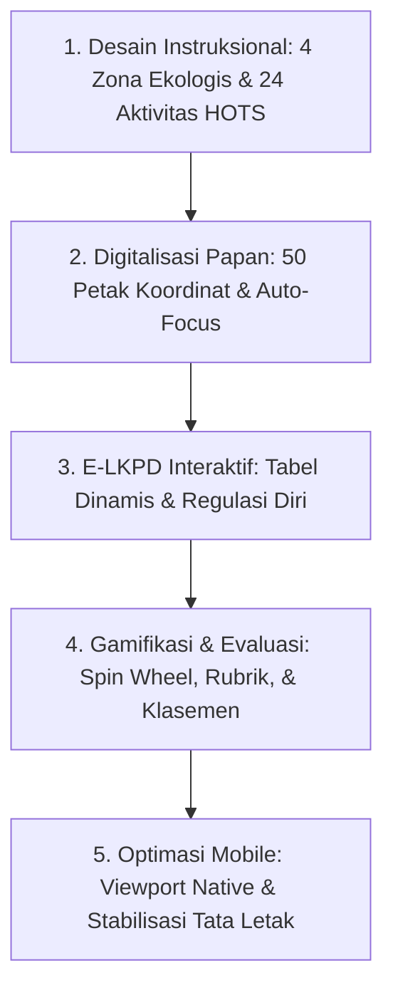
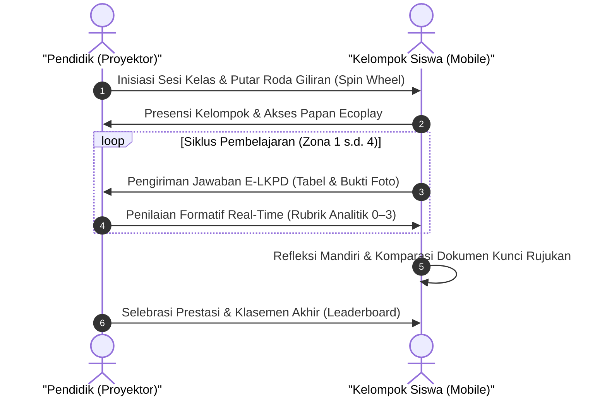

# DOKUMENTASI ALUR PENGEMBANGAN MEDIA PEMBELAJARAN DIGITAL "ECOPLAY"

---

## 1. Latar Belakang dan Urgensi Inovasi

Pembelajaran Biologi pada materi Ekosistem menuntut pemahaman konseptual yang mendalam, kemampuan observasi empiris di lingkungan, serta keterampilan menganalisis fenomena interaksi antarkomponen biotik dan abiotik. Namun, pelaksanaan pembelajaran konvensional kerap menghadapi beberapa kendala pedagogis dan operasional:

1. **Keterbatasan Media Fisik**: Papan permainan manual berbasis kertas atau banner rentan mengalami kerusakan fisik, hilangnya bidak penanda, dan memiliki visualisasi statis yang sulit disesuaikan dengan dinamika kelas.
2. **Beban Administratif Pengelolaan LKPD Cetak**: Penggunaan Lembar Kerja Peserta Didik (LKPD) berbasis kertas menimbulkan pemborosan logistik penggandaan, keterbatasan ruang untuk dokumentasi observasi lapangan, serta memperlambat proses penilaian formatif oleh pendidik.
3. **Rendahnya Keterlibatan Aktif dan Keterampilan Regulasi Diri**: Siswa cenderung pasif menerima kunci jawaban dari guru tanpa melalui proses refleksi metakognitif untuk memvalidasi pemahaman konseptual mereka secara mandiri.

Untuk mengatasi permasalahan tersebut, dikembangkan media **Ecoplay**—sebuah platform pembelajaran digital terpadu yang memadukan prinsip *Game-Based Learning* (pembelajaran berbasis permainan), *Electronic Student Worksheet* (E-LKPD), serta *Self-Regulated Learning* (pembelajaran mandiri teregulasi) ke dalam satu ekosistem web yang interaktif, adaptif, dan responsif.

---

## 2. Diagram Alur Pengembangan Media (Development Lifecycle)

Pengembangan platform Ecoplay dilaksanakan secara terstruktur melalui lima tahapan utama:

---

## 3. Rincian Komprehensif Tahapan Pengembangan

### 3.1. Tahap I: Desain Instruksional dan Pemetaan Kurikulum
Fondasi utama pengembangan Ecoplay berpijak pada prinsip keselarasan instruksional (*constructive alignment*):
* **Struktur Alokasi Waktu (3 Pertemuan @ 90 Menit)**:
  * **Pertemuan 1 (Zona 1: Komponen Ekosistem)**: Mengidentifikasi perbedaan komponen biotik-abiotik dan menganalisis peran masing-masing komponen.
  * **Pertemuan 2 (Zona 2: Interaksi Makhluk Hidup & Zona 3: Aliran Energi)**: Mengobservasi pola simbiosis, predasi, kompetisi, serta menyusun rantai makanan dan piramida energi.
  * **Pertemuan 3 (Zona 4: Jenis-Jenis Ekosistem & Evaluasi Akhir)**: Mengomparasikan karakteristik bioma terestrial dan akuatik, finalisasi portofolio E-LKPD, serta penentuan apresiasi kelompok.
* **Taksonomi Berpikir Kritis**: Aktivitas belajar dirancang berbasis indikator berpikir kritis (analisis, inferensi, evaluasi, dan eksplanasi) pada ranah kognitif tingkat tinggi (*Higher Order Thinking Skills* / HOTS, level C4–C5).

---

### 3.2. Tahap II: Digitalisasi Papan Permainan dan Pemetaan Koordinat Spasial
Tahap ini mentransformasikan aset grafis dua dimensi (`image.png`, 1600 × 1600 piksel) menjadi media interaktif yang kaya respons:
* **Pemetaan Koordinat Vektor (SVG Coordinate Mapping)**: Setiap petak dari total 50 petak dipetakan secara matematis menggunakan koordinat $(X, Y)$ presisi. Sistem membedakan secara spesifik fungsi petak: petak observasi lapangan (🌿 *Challenge*), petak teka-teki analisis (🐉 *Riddle*), petak transisi langkah, serta petak capaian zona (🌟 *Badge Tile*).
* **Sistem Kamera Penjejak Otomatis (*Dynamic Pawn Tracking*)**: Mengatasi keterbatasan layar gawai siswa melalui algoritma auto-focus yang secara dinamis memperbesar (*zoom-in* skala 2.25x pada smartphone) dan mengarahkan tampilan layar tepat pada posisi pion aktif kelompok.

---

### 3.3. Tahap III: Pengembangan E-LKPD Interaktif dan Instrumen Regulasi Diri
Guna menggantikan lembar kerja kertas konvensional, dikembangkan antarmuka formulir digital yang disesuaikan dengan karakteristik penugasan:
* **Tabel Observasi Terstruktur**: Siswa dapat menginput data temuan lapangan secara terstruktur dengan fitur penambahan/penghapusan baris tabel yang adaptif.
* **Integrasi Kamera Gawai**: Memfasilitasi otentisitas investigasi ilmiah dengan memungkinkan siswa mengunggah bukti foto lapangan langsung melalui kamera smartphone.
* **Visualisasi Aliran Energi**: Memfasilitasi konstruksi konsep rantai makanan melalui penyusunan nodus produsen-konsumen yang dihubungkan dengan panah aliran energi secara digital.
* **Dukungan Diferensiasi Sumber Belajar**: Mengintegrasikan tautan repositori awan (*cloud repository*) sebagai perancah (*scaffolding*) bagi kelompok yang mengalami kendala dalam menemukan objek biologis di lingkungan sekolah.
* **Instrumen Regulasi Diri (*Self-Regulated Learning*)**: Menyediakan riwayat portofolio jawaban kelompok terdahulu dan membuka akses rujukan kunci konseptual resmi, melatih siswa untuk melakukan evaluasi diri (*self-assessment*) dan metakognisi.

---

### 3.4. Tahap IV: Integrasi Mekanika Gamifikasi dan Instrumen Evaluasi
Mekanika permainan diterapkan secara proporsional untuk memelihara motivasi intrinsik tanpa mengorbankan kedalaman akademik:
* **Roda Acak Penentu Giliran (*Spin Wheel Generator*)**: Menghadirkan mekanisme pengacakan giliran kelompok yang transparan dan visual di hadapan kelas melalui proyeksi layar utama pendidik.
* **Akses Panduan Regulasi Permainan Terintegrasi**: Menyediakan modul aturan permainan langsung pada bilah navigasi aplikasi guna memastikan kejelasan alur penugasan dan sportivitas kompetisi.
* **Lencana Kecepatan (*Speed Badge Race*)**: Memberikan penghargaan poin tambahan (3, 2, dan 1 poin) bagi tiga kelompok pertama yang berhasil mencapai garis batas akhir setiap zona ekologi.
* **Papan Klasemen Terintegrasi (*Comprehensive Leaderboard*)**: Mengakumulasikan perolehan nilai berdasarkan sintesis dua komponen: **skor kualitas jawaban LKPD berbasis rubrik analitik (bobot maksimal 72 poin)** dan **poin lencana kecepatan (bobot maksimal 12 poin)**, sehingga akumulasi maksimal bernilai 84 poin.

---

### 3.5. Tahap V: Optimasi Aksesibilitas dan Responsivitas Antarmuka Perangkat Bergerak
Menyadari bahwa mayoritas peserta didik mengakses aplikasi menggunakan smartphone pribadi (*Bring Your Own Device* / BYOD), dilakukan optimasi teknis antarmuka:
* **Standarisasi Viewport Responsif Native**: Mengonfigurasi meta tag viewport seluler agar antarmuka tidak mengalami pengecilan skala desktop (*desktop zoom-out*) saat dirender pada browser mobile.
* **Penyelarasan Skala Tipografi dan Komponen Sentuh**: Mengatur ukuran teks instruksi dan pertanyaan pada proporsi yang nyaman dibaca, memperluas target sentuh tombol (*touch target minimum 40px*), serta mencegah pembesaran otomatis (*auto-zoom*) pada peramban iOS Safari.
* **Stabilisasi Posisi Bilah Navigasi (*Sticky Header Anchoring*)**: Menerapkan penguncian lapisan tata letak dan penanganan event gulir guna memastikan bilah navigasi atas tidak terdorong keluar layar saat keyboard virtual smartphone aktif.
* **Simplifikasi Penamaan Komponen**: Membersihkan keterangan redundan pada label judul tabel agar efisien terhadap ruang pandang layar ponsel yang terbatas.

---

## 4. Model Interaksi Pembelajaran di Ruang Kelas

Bagan alir berikut mengilustrasikan pembagian peran dan interaksi simultan antara **Pendidik** (sebagai fasilitator dan evaluator) dan **Peserta Didik** (sebagai pembelajar kolaboratif) selama sesi berlangsung:

---

## 5. Analisis Komparatif: Media Konvensional vs Platform Ecoplay

Berikut matriks perbandingan antara pendekatan pembelajaran konvensional dan implementasi platform digital Ecoplay:

| Dimensi Parameter | Pendekatan Konvensional | Platform Digital Ecoplay | Nilai Tambah Pedagogis |
| :--- | :--- | :--- | :--- |
| **Media Visual Papan** | Banner/karton cetak statis, pion plastik rentan hilang atau tergeser. | Papan vektor digital interaktif dengan sistem koordinat presisi dan *auto-focus*. | Menghilangkan distraksi teknis; visualisasi selalu konsisten dan adaptif di layar siswa. |
| **Pengerjaan Lembar Kerja** | Menulis manual di lembar kertas fotokopi; ruang pencatatan terbatas. | Input digital terstruktur (tabel dinamis, pengetikan analitis terpadu). | Data tersimpan sistematis, keterbacaan hasil investigasi siswa terjamin 100%. |
| **Dokumentasi Empiris** | Foto observasi terfragmentasi di galeri pribadi siswa tanpa integrasi tugas. | Pengambilan dan pengunggahan foto langsung menempel pada modul aktivitas. | Menjamin keaslian data (*scientific authenticity*) dan mempermudah verifikasi bukti belajar. |
| **Mekanisme Giliran** | Lempar dadu fisik manual yang berpotensi memicu ketidaktertiban kelas. | Roda acak digital (*Spin Wheel*) terpusat pada proyektor utama kelas. | Menciptakan suasana belajar yang tertib, adil, transparan, dan antusias. |
| **Umpan Balik Penilaian** | Penilaian tertunda (*delayed feedback*) karena guru harus mengoreksi tumpukan kertas. | Penilaian formatif langsung (*real-time grading*) melalui panel rubrik analitik guru. | Guru dapat mendeteksi miskonsepsi siswa secara langsung pada saat pembelajaran berjalan. |
| **Pengembangan Metakognisi** | Pembahasan kunci jawaban dilakukan satu arah secara klasikal oleh guru. | Modul regulasi mandiri (*self-regulated learning*) membandingkan jawaban vs rujukan. | Mendorong kemandirian berpikir kritis, evaluasi diri, dan pemahaman konsep mendalam. |
| **Rekapitulasi Prestasi** | Perhitungan skor gabungan dilakukan manual pasca-pembelajaran usai. | Algoritma *Leaderboard* otomatis memadukan nilai LKPD dan bonus lencana kecepatan. | Memberikan penghargaan kompetisi sehat yang objektif, transparan, dan komprehensif. |

---

## 6. Implikasi Pedagogis dan Kesimpulan

Pengembangan media **Ecoplay** menghadirkan solusi teknologi pembelajaran yang harmonis antara aspek teoritis dan praktis di ruang kelas. Melalui perpaduan antara **kemudahan operasional bagi pendidik** dan **pengalaman belajar yang imersif bagi peserta didik**, Ecoplay membuktikan bahwa digitalisasi pembelajaran tidak harus rumit, melainkan berfokus pada efektivitas pencapaian kompetensi berpikir kritis, kolaboratif, dan reflektif dalam pembelajaran sains modern.
