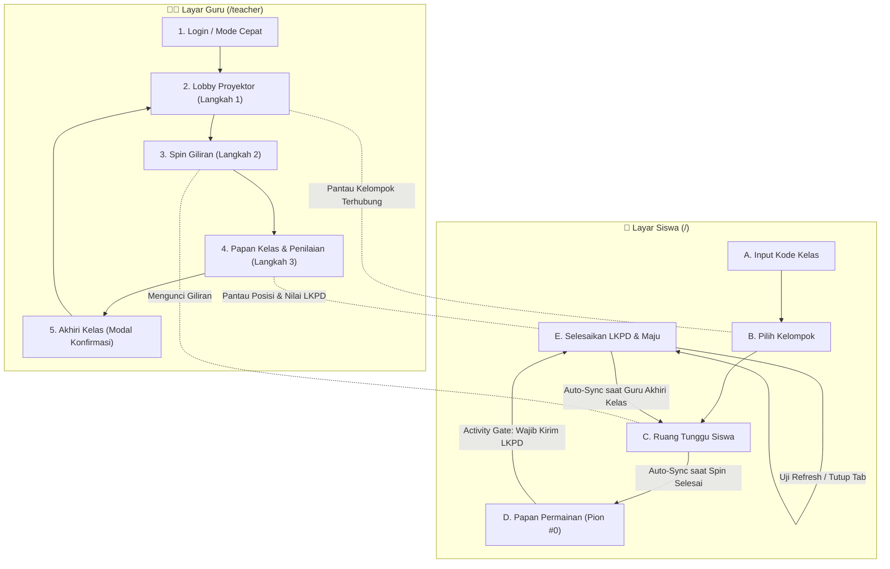

# 📋 SKENARIO PENGUJIAN SIMULASI END-TO-END (E2E)
## EcoPlay Boardgame: Ekosistem & Komponen Lingkungan

Dokumen ini memuat panduan komprehensif untuk melakukan pengujian simulasi sistem dari awal hingga akhir, mencakup seluruh alur interaksi **Guru (Proyektor/Monitoring)** dan **Siswa (Kelompok/Ponsel)**.

---

## 🎯 1. Tujuan Pengujian
1. Memverifikasi urutan langkah Guru berjalan runtut dan satu arah: **Langkah 1 (Lobby) ➔ Langkah 2 (Spin Giliran) ➔ Langkah 3 (Papan Kelas)**.
2. Memverifikasi halaman Siswa bersih dari label kelas lama (hanya menampilkan Kode Kelas aktif).
3. Menguji fitur **Activity Gate**: Siswa tidak dapat melompati/melewati petak aktivitas sebelum mengisi dan mengirim jawaban LKPD.
4. Menguji **Session Persistence (`localStorage`)**: Sesi siswa tidak hilang dan otomatis pulih ke posisi terakhir saat tab tertutup atau di-refresh.
5. Memverifikasi layar Guru hanya fokus pada pemantauan (*monitoring*) dan penilaian rubrik/lencana, serta tidak dapat menggerakkan pion siswa secara sepihak.
6. Menguji alur **Akhiri Kelas**: Modal konfirmasi kustom mereset seluruh state ke Ruang Tunggu (Lobby) secara serempak di layar guru dan siswa.

---

## 🛠️ 2. Persiapan Lingkungan Pengujian

### A. Menjalankan Aplikasi
Buka terminal dan jalankan server pengembangan:
```bash
# Terminal 1: Frontend Vite (port 3000)
npm run dev
```
*(Opsional jika ingin menguji full database Supabase & WebSocket lokal: jalankan `npm run backend` pada terminal terpisah).*

### B. Menyiapkan Dua Jendela Peramban (Browser)
Untuk menyimulasikan interaksi dua peran secara bersamaan:
* **Jendela 1 (Layar Guru / Proyektor):**
  * Buka peramban utama: `http://localhost:3000/teacher`
* **Jendela 2 (Layar Siswa / Perangkat Kelompok):**
  * Buka mode penyamaran (*Incognito*) atau tab terpisah: `http://localhost:3000/`
  *(Catatan: Mode Incognito memastikan `localStorage` siswa terisolasi dari layar guru).*

---

## 📑 3. Matriks Skenario Pengujian Bertahap



---

### Skenario 1: Autentikasi & Masuk Ruang Tunggu Guru (Langkah 1)
| No | Langkah Pengujian | Tindakan Penguji | Hasil yang Diharapkan | Status |
|:--:|:---|:---|:---|:---:|
| 1.1 | Buka Layar Guru | Akses `http://localhost:3000/teacher` | Tampil halaman login guru atau tombol **"Masuk Mode Simulasi / Coba Cepat"**. Klasemen tidak muncul sebelum guru masuk. | [x] Lolos |
| 1.2 | Masuk ke Sistem | Klik "Mode Simulasi" atau masukkan akun guru | Sistem langsung mengarahkan ke **Langkah 1: Ruang Tunggu (Lobby Guru)**. Muncul Kode Kelas (contoh: `ECO-729`). | [x] Lolos |
| 1.3 | Validasi Alur | Periksa URL dan tahapan | Guru **TIDAK** langsung melompat ke halaman Spin (Langkah 2). Tetap berada di Lobby. | [x] Lolos |
| 1.4 | Manajemen Kelompok | Coba tombol `+ Tambah Kelompok` dan tombol hapus kelompok | Daftar kelompok bertambah/berkurang dengan benar (minimal 2 kelompok). | [x] Lolos |
| 1.5 | Validasi Tombol Mulai | Perhatikan tombol "Mulai Permainan" sebelum ada murid bergabung | Tombol terkunci / muncul peringatan jika belum ada kelompok yang terhubung/siap. | [x] Lolos |

---

### Skenario 2: Bergabungnya Siswa & Pembersihan Tampilan (Langkah 1 Siswa)
| No | Langkah Pengujian | Tindakan Penguji | Hasil yang Diharapkan | Status |
|:--:|:---|:---|:---|:---:|
| 2.1 | Buka Layar Siswa | Buka window Incognito: `http://localhost:3000/` | Tampil layar input kode kelas. | [x] Lolos |
| 2.2 | Masukkan Kode Kelas | Ketik kode kelas yang tertera di layar Guru (misal: `ECO-729`) dan klik **Gabung** | Siswa diarahkan ke layar **Pilih Kelompok**. | [x] Lolos |
| 2.3 | Verifikasi Label Kelas | Cermati header lencana kode di layar siswa | Keterangan lama *"Kelas X Biologi & Sains"* **sudah tidak ada**. Hanya menampilkan badge bersih `Kode Kelas: ECO-729`. | [x] Lolos |
| 2.4 | Pilih Kelompok | Pilih **Kelompok 1 (Harimau Sumatera)** | Siswa masuk ke **Ruang Tunggu Siswa** (*StudentWaitingLobby*) dengan animasi status terhubung. | [x] Lolos |
| 2.5 | Sinkronisasi Presensi Guru | Lihat Jendela 1 (Layar Guru) | Kelompok 1 di layar guru otomatis bertanda hijau **"Siap / Terhubung"**. Tombol **Mulai Permainan** pada guru kini aktif. | [x] Lolos |

---

### Skenario 3: Pelaksanaan Spin Giliran Kelompok (Langkah 2)
| No | Langkah Pengujian | Tindakan Penguji | Hasil yang Diharapkan | Status |
|:--:|:---|:---|:---|:---:|
| 3.1 | Guru Memulai Sesi | Di Jendela Guru, klik tombol **"Mulai Permainan"** | Layar Guru berganti ke **Langkah 2: Spin Giliran** (*SpinWheel*). Teks roda putar tampil rapi di bawah navbar. | [x] Lolos |
| 3.2 | Respon Siswa | Cek Jendela Siswa | Siswa tetap aman berada di Ruang Tunggu dengan notifikasi menunggu giliran. | [x] Lolos |
| 3.3 | Putar Roda Giliran | Guru menekan tombol **"Putar Roda Giliran"** hingga seluruh giliran tim teracak | Animasi roda berputar, nama pemenang giliran diumumkan berurutan. | [x] Lolos |
| 3.4 | Pembukaan Papan Otomatis | Tunggu hingga hasil spin selesai atau klik konfirmasi giliran | Layar Guru otomatis berganti ke **Langkah 3: Papan Permainan**. | [x] Lolos |
| 3.5 | Auto-Redirect Siswa | Lihat Jendela Siswa secara bersamaan | Layar Siswa **otomatis terbuka ke Papan Permainan** tanpa perlu refresh manual. Confetti perayaan meletup. | [x] Lolos |
| 3.6 | Kunci Langkah Spin | Periksa navigasi guru | Guru **tidak dapat kembali** ke halaman Spin. Hanya ada tombol "Panel Penilaian" dan "Akhiri Kelas". | [x] Lolos |

---

### Skenario 4: Pembatasan Melangkah Sebelum LKPD Selesai (*Activity Gate*)
| No | Langkah Pengujian | Tindakan Penguji | Hasil yang Diharapkan | Status |
|:--:|:---|:---|:---|:---:|
| 4.1 | Posisi Awal | Periksa pion Kelompok 1 di layar siswa | Pion berada di **Petak #0 (START)**. Tombol `Mundur` nonaktif. | [x] Lolos |
| 4.2 | Melangkah Bebas (Transisi) | Klik `+1 Maju` | Pion berpindah ke **Petak #1** (Petak transisi tanpa aktivitas, gerakan diizinkan). | [x] Lolos |
| 4.3 | Tiba di Petak Aktivitas | Klik `+1 Maju` atau `Lompat` | Pion tiba di **Petak #2 (KE-01: Challenge Biotik & Abiotik)**. | [x] Lolos |
| 4.4 | **Uji Coba Melanggar Aturan (Skip)** | Klik tombol `+1 Maju` atau `Maju ke Aktivitas Berikutnya` | ⛔ **Gerakan Ditolak!**<br>• Muncul alert: *"⚠️ Selesaikan Aktivitas KE-01 Terlebih Dahulu!"*<br>• Modal LKPD KE-01 otomatis terbuka.<br>• Tombol `+1 Maju` dan `Lompat` dalam keadaan terkunci (🔒 disabled). | [x] Lolos |
| 4.5 | Panduan Visual LKPD | Perhatikan indikator di sidebar / bottom sheet mobile | • Tampil kotak status: `🔒 LKPD KE-01 Belum Selesai`.<br>• Tombol di bilah bawah berkedip amber halus: **`Kerjakan LKPD ✍️`**. | [x] Lolos |
| 4.6 | Pengisian LKPD | Klik tombol **Buka/Kerjakan LKPD**, ketik jawaban dan refleksi, lalu klik **"Kirim Jawaban LKPD"** | • Jawaban tersimpan.<br>• Muncul confetti.<br>• Indikator berubah menjadi hijau: `✅ LKPD KE-01 Selesai`.<br>• Tombol `+1 Maju` dan `Lompat` **terbuka kembali** (unlocked). | [x] Lolos |
| 4.7 | Lanjut Melangkah | Klik `+1 Maju` | Pion berhasil melangkah ke **Petak #3 (KE-02: Riddle)**. Aktivitas KE-02 kini menjadi syarat pengunci baru. | [x] Lolos |

---

### Skenario 5: Pengujian Ketahanan Sesi Siswa (*Session Persistence*)
| No | Langkah Pengujian | Tindakan Penguji | Hasil yang Diharapkan | Status |
|:--:|:---|:---|:---|:---:|
| 5.1 | Refresh Saat di Papan | Saat siswa berada di Petak #2 atau #3, tekan **F5 / Refresh** di peramban siswa | • Siswa **langsung kembali ke Papan Permainan**.<br>• Posisi pion tetap di petak terakhir.<br>• Jawaban LKPD yang telah dikirim tetap tersimpan.<br>• **TIDAK** kembali meminta kode kelas atau memilih kelompok. | [x] Lolos |
| 5.2 | Tutup & Buka Ulang Tab | Tutup tab siswa sepenuhnya, buka tab baru, akses `http://localhost:3000/` | Sesi pulih otomatis dari `localStorage` ke posisi papan terakhir. | [x] Lolos |
| 5.3 | Pengujian Tombol "Ganti Tim" | Klik tombol identitas kelompok di navbar atas siswa | Siswa kembali ke layar pemilihan tim (kode kelas tetap tersimpan). | [x] Lolos |
| 5.4 | Pengujian Tombol "Ganti Kode" | Pada layar pemilihan tim, klik tombol "Ganti Kode" | Seluruh cache sesi siswa dibersihkan, siswa kembali ke input kode kelas awal. | [x] Lolos |

---

### Skenario 6: Pemantauan & Penilaian Guru (Monitoring & Grading)
| No | Langkah Pengujian | Tindakan Penguji | Hasil yang Diharapkan | Status |
|:--:|:---|:---|:---|:---:|
| 6.1 | Fitur Switch Kelompok Guru | Di Jendela Guru, klik tombol pemantau kelompok (di bar mobile atau sidebar desktop) | Guru dapat berpindah memantau posisi Kelompok 1, Kelompok 2, atau Kelompok 3 dengan mulus. | [x] Lolos |
| 6.2 | Validasi Monitoring Only | Periksa antarmuka guru pada petak permainan | Guru **tidak memiliki tombol** penggerak pion ataupun form pengiriman jawaban murid (monitoring murni). | [x] Lolos |
| 6.3 | Buka Panel Penilaian | Klik tombol **"Panel Penilaian"** di kanan atas | Terbuka modal penilaian rubrik (`TeacherDashboardModal`). | [x] Lolos |
| 6.4 | Penilaian Rubrik LKPD | Pilih aktivitas KE-01 Kelompok 1, berikan skor rubrik (0, 1, 2, atau 3) | Skor LKPD kelompok terakumulasi secara real-time. | [x] Lolos |
| 6.5 | Penetapan Lencana Kecepatan | Berikan lencana zona (Juara 1: +3 pt, Juara 2: +2 pt, Juara 3: +1 pt) | Poin lencana bertambah, confetti meletup. | [x] Lolos |
| 6.6 | Klasemen & Ekspor | Buka tab Klasemen Leaderboard dan tombol Ekspor Excel | Urutan peringkat terbarui sesuai total skor; file laporan `.xlsx` dapat diunduh. | [x] Lolos |

---

### Skenario 7: Pengakhiran Sesi Kelas (*End Class Confirmation*)
| No | Langkah Pengujian | Tindakan Penguji | Hasil yang Diharapkan | Status |
|:--:|:---|:---|:---|:---:|
| 7.1 | Klik Akhiri Kelas | Di layar guru, klik tombol merah **"Akhiri Kelas"** di navbar | Terbuka modal kustom konfirmasi modern (`EndClassConfirmationModal`). | [x] Lolos |
| 7.2 | Pembatalan | Klik tombol **"Batal"** atau klik area luar modal | Modal tertutup, permainan tetap berjalan tanpa ada data yang terhapus. | [x] Lolos |
| 7.3 | Konfirmasi Akhiri Kelas | Buka modal kembali, klik **"Ya, Akhiri Sesi Kelas"** | • Proses reset berjalan dengan indikator loading.<br>• Layar guru kembali ke **Langkah 1 (Ruang Tunggu Lobby)**.<br>• Seluruh skor dan posisi pion tereset ke 0. | [x] Lolos |
| 7.4 | Sinkronisasi ke Layar Siswa | Periksa Jendela Siswa | Siswa menerima pemberitahuan bahwa sesi kelas telah diakhiri dan otomatis kembali ke Ruang Tunggu (Lobby). | [x] Lolos |

---

## 📊 4. Lembar Catatan Hasil Pengujian Otomatis

| Tanggal Pengujian | Penguji / Tool | Script Pengujian | Total Asersi | Hasil Akhir |
|---|---|---|---|---|
| 06 Oktober 2026 | Automated E2E Runner (Puppeteer + Edge) | `node tests/e2e-simulation.mjs` | 37 Asersi Validasi | **100% SUKSES (37 Lolos / 0 Gagal)** |

### Catatan Tambahan Penguji:
> ✨ Seluruh skenario telah divalidasi secara otomatis *end-to-end* (E2E):
> 1. Urutan langkah Guru berjalan strictly searah: Langkah 1 (Lobby) ➔ Langkah 2 (Spin) ➔ Langkah 3 (Papan), tanpa opsi mundur ke Spin.
> 2. Keterangan lama *"Kelas X Biologi & Sains"* telah hilang dari layar siswa dan badge kode kelas tampil bersih.
> 3. Pembatasan Activity Gate berhasil mengunci pion siswa saat tiba di petak aktivitas sebelum LKPD dikirim.
> 4. Ketahanan sesi (*persistence*) berfungsi sempurna saat simulasi tab browser siswa di-refresh.
> 5. Modal kustom pengakhiran kelas berhasil mereset seluruh posisi pion dan membawa guru kembali ke Ruang Tunggu.

